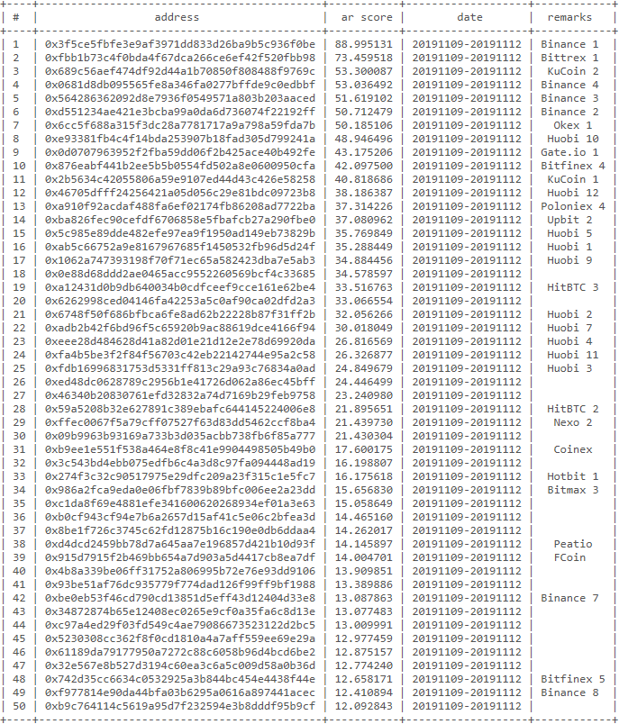

# 以太坊ERC20代币账户指数计算

## 什么是账户指数
账户指数（Account Rank，简称AR）是ASResearch研究团队提出的，以流动性、传播性、互操作性等体现数据互动关系的因素为基础的，用于衡量和描述以太坊主网上的地址、智能合约、去中心化应用等对象的影响力的一个统计指标。账户指数通过对链上数据进行综合统计并排序后，能够体现区块链地址（对象）在整个网络中的重要程度。

## 为什么使用账户指数
就目前而言，大部分区块链项目都选择以用户的资产质押或者利用PageRank算法作为衡量用户重要性的价值指标。然而这样的设定将会导致：

- 1）资产质押的方式会使得用户为了保证自身权益而大量吸收资产并避免资产外流，降低资产的流动性；

- 2）PageRank算法在区块链网络中无法有效抵抗女巫攻击。

ASResearch研究团队提出的账户指数（AR）是一个综合考量区块链上数据的，兼顾用户地址资产保有量以及资产流a动性的用户地址价值衡量指标。利用独创的Wilbur函数f来计算账户指数，使其满足：

- a）f(x+y) > f(x) + f(y)，严格抵抗女巫攻击；

- b）limx, y → ∞, f(x+y) = f(x) + f(y)，避免资产大户的绝对统治，促进资产流通。

## 账户指数（AR）计算公式

- 参数说明：

> 1）M：统计时间段内某地址的ERC20资产中值占比。对地址的balance按照每128个区块高度的间隔进行采样，并选出中位数作为地址的ERC20资产中值，再除以该货币的现时流通总量获得比值。
> 
> 2）I：统计时间段内某地址ERC20资产流入占比。对在统计时间段内的流向某一地址的资产进行求和，再除以该货币的现时流通总量获得比值。
> 
> 3）O：统计时间段内某地址ERC20资产流出占比。对在统计时间段内的从某一地址流出的资产进行求和，再除以该货币的现时流通总量获得比值。
> 
> 备注：
> 
> a）所有参数计算均是针对单一种ERC20代币以及某一个具体的地址；
> 
> b）I和O进行计算之前已经过去环处理。

 

## 账户指数（AR）统计流程

账户指数（AR）的统计过程如下：

&emsp;&emsp;（1）收集在统计时间段内以太坊主网上发生的所有交易，并筛选出用户地址调用ERC20代币合约进行转账的交易作为统计交易集，筛选方式为：检查交易的data属性，以“0xa9059cbb”（ERC20合约中transfer函数的编码）为开头的交易即为进行代币转账的交易；

&emsp;&emsp;（2）从统计样本的所有交易中找出涉及到的所有用户地址（包括流出地址和流入地址），作为统计对象集，其中，流出地址是交易中的FROM属性项，流入地址通过检查交易的data属性，截取data字段的第34个字符到第74个字符即为流入地址（调用transfer函数，标准data字段长度为138个字符，前10个字符是函数名编码，10—74共64个字符长度为address参数，其中用户地址长度为40字符，参数长度不足时会自动在参数前方补0，故34—74为地址，而74—138则是转账金额）；

&emsp;&emsp;（3）对（2）中采集到的用户地址，求解其在统计时间段的起始区块时的ERC20代币余额（balance）。在获得交易集后，可以从height属性中获得区块高度范围，通过API调用ERC20合约提供的函数balance（函数编码“0x70a08231”）可以获得指定地址在该区块高度上的余额。

&emsp;&emsp;（4）求解地址ERC20资产中值占比。根据（3）中获得的余额数据以及（1）中的交易集，按照128个区块高度进行分组，分组后，对该区块间隔内的所有交易进行重新验算，根据交易的status属性（表示交易是否成功），来对流出地址和流入地址的余额balance进行增加或减少（如果交易成功，流出地址余额减少，流入地址余额增加），然后取每一个区块间隔中最高的区块高度上的地址余额作为样本点；直到所有的分组都验算完成后，流出地址和流入地址都得出一系列的样本点，然后再对每一个地址的样本集，取中位数后再除以该ERC20代币现时总流通量，作为该地址在统计时间段内的资产中值占比。

&emsp;&emsp;（5）求解地址ERC20资产出入度占比。从（1）的交易集中筛选出所有交易成功（status=1）的交易，并用这些交易构造地址转账图。对转账图进行去环和整合后，得到每个地址的流入和流出ERC20代币量，再分别除以该代币的现时流通量，得到该地址的ERC20出度占比和入度占比。

&emsp;&emsp;（6）根据（4）和（5）中得到的数据集，以地址为单位，分别将每个地址对应的资产中值占比和出入度占比数据代入公式求解该地址在统计时间段内的账户指数（AR）。

&emsp;&emsp;（7）计算完成后，分别进行以下两项数据统计：

&emsp;&emsp;&emsp;&emsp; a）以ERC20代币为单位，求在统计时间内所有使用该代币进行转账的用户的账户指数之和，以此作为该代币的活跃度指数。

&emsp;&emsp;&emsp;&emsp; b）以单一地址为单位，求在统计时间内该地址所有进行过转账交易的ERC20代币的账户指数（AR）之和，作为该用户的活跃度指数。

## 统计结果

我们设定统计的时间段为2019年10月28日至2019年10月31日，针对CoinMarketCap网站Top Cryptocurrencies 榜单上前100名的加密货币中的ERC20代币进行统计，统计的代币数量有44个，涉及用户地址131140个，最终的统计结果如下图：

 
  

 
 图1.1 ERC20代币活跃度排名 

  

 
  

 
 图1.2 用户活跃度排名（前50）

  

通过观察统计结果图1可知，在统计的ERC20代币中，USDT、USDC、DAI和PAX作为主要的稳定币项目，具有流动性强和散布程度高等特点，其账户指数（AR）比较高；而
类似XMX等存在代币集中销毁行为的ERC20代币，尽管存在基金会（占有代币总量的20%以上）回购代币的行为，但是其账户指数（AR）不会过高，因此可以认为，账户指
数在避免资产大户的绝对统治上是有效的。

根据公式设计和统计流程可知，如果想通过女巫攻击来提高用户地址的账户指数，该用户需要在保有一定量的数字资产的情况下，进行大量的货币流转才可以实现。而在统计流程中，我们对用户的转账行为进行了去环处理，防止用户通过来回转账的方式提高货币流转量，这意味着用户必须伪造大量的地址并进行转账，或者对地址进行大额度转账，才可能实现女巫攻击。账户指数的统计过程使得实现女巫攻击的成本大大提高。
